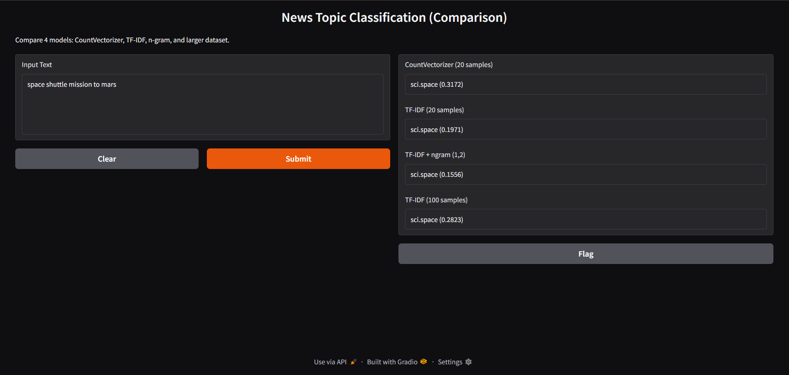

#  News Group Classification using Vectorization

##  Project Overview

This project implements a simple text classification system based on vectorization techniques and cosine similarity.

The system classifies input text into one of three categories:

- `comp.graphics`
- `sci.space`
- `talk.religion.misc`

Instead of using a traditional machine learning model, the approach relies on measuring similarity between the input text and training documents.

---

##  Technologies

- Python
- scikit-learn
- NumPy
- Gradio (for web interface)

---
##  Interface Preview



##  Methodology

The project compares multiple vectorization approaches:

- **CountVectorizer** — converts text into word frequency vectors
- **TfidfVectorizer** — reduces the impact of common words
- **TF-IDF + n-grams (1,2)** — includes word combinations
- **Cosine Similarity** — measures similarity between vectors

This is not a trained classifier — it works by finding the most similar document in the dataset.

---

##  Efficient Dataset Loading

To improve performance, the dataset is loaded only once using a shared module (`dataset.py`).

All models reuse the same data instead of downloading it multiple times.

### Benefits:

- Faster startup
- Cleaner architecture
- No redundant data loading

---

##  Q1. Why does similarity become 0.0000?

Example input:

```bash
Exploring the mars with a robotic rover.
```

###  Reason 1: Vocabulary mismatch

Words like:

- `robotic`
- `rover`

may not exist in the training dataset.

→ They are ignored → vector becomes mostly zeros.

---

###  Reason 2: No overlapping words

Cosine similarity depends on shared words.

If no overlap:
```bash
dot product = 0 → similarity = 0.0000
```

---

###  Reason 3: Stop-word removal

Using:

```python
stop_words='english'
```
common words (the, is, and) are removed, reducing overlap further.

##  Experiments (Q2)

Several experiments were conducted to improve the model:

### 1. CountVectorizer (20 samples)
Basic model using word counts.

### 2. TfidfVectorizer (20 samples)
Improves results by weighting important words higher.

### 3. TF-IDF with n-grams (1,2)
Includes word combinations (e.g., "space mission").

### 4. TF-IDF with 100 samples
Increasing dataset size improved performance and stability.

---
##  Results

- TF-IDF produced more reliable results than CountVectorizer
- n-grams made the model more strict (lower similarity scores)
- Increasing samples from 20 to 100 improved similarity and stability

---

##  How to Run

1. Install dependencies:

```bash
pip install -r requirements.txt
```

2. Run the program:

```bash
python main.py
```

3. Enter English text:


```bash
rocket launch nasa orbit satellite
```

Example Output

```bash
Model                                | Category                | Similarity
-----------------------------------------------------------------------
CountVectorizer (20 samples)         | sci.space               | 0.1066
TfidfVectorizer (20 samples)         | sci.space               | 0.1014
TF-IDF + ngram (20 samples)          | sci.space               | 0.0704
TfidfVectorizer (100 samples)        | sci.space               | 0.1264
```

## Detailed Results Analysis

The similarity scores in this project may appear relatively low (e.g., 0.07–0.12), but this is expected for this type of text processing task.

### Why are the similarity scores low?

The model compares a short input sentence with full-length news documents.
Since the overlap of words is limited, the cosine similarity values tend to be small.

### Additionally:

The vector space is high-dimensional and sparse
Most words do not appear in every document
If words do not overlap → similarity approaches 0

Therefore, low values do not indicate poor performance.
The most important factor is whether the correct category is selected.

### Why does TF-IDF give lower scores than CountVectorizer?

TF-IDF reduces the importance of common words such as:

```bash
the, is, and, this
```

Instead, it emphasizes more informative words.

As a result:

- Similarity scores become lower
- But the model becomes more accurate and meaningful

### Why does n-gram produce the lowest scores?

When using:

```bash
ngram_range=(1, 2)
```

the model considers both:

- single words → "space"
- word pairs → "space mission"

This makes the model more strict because:

- both words in a phrase must match
- partial matches are less effective

Therefore, similarity scores decrease, but precision increases.

### Why does the 100-sample model give higher similarity?

Increasing the dataset size from 20 to 100 samples per category improves performance because:

- The vocabulary becomes richer
- There are more chances for word overlap
- The model has better coverage of each topic

As a result:

- Similarity scores increase
- Results become more stable
- Fewer cases of similarity = 0